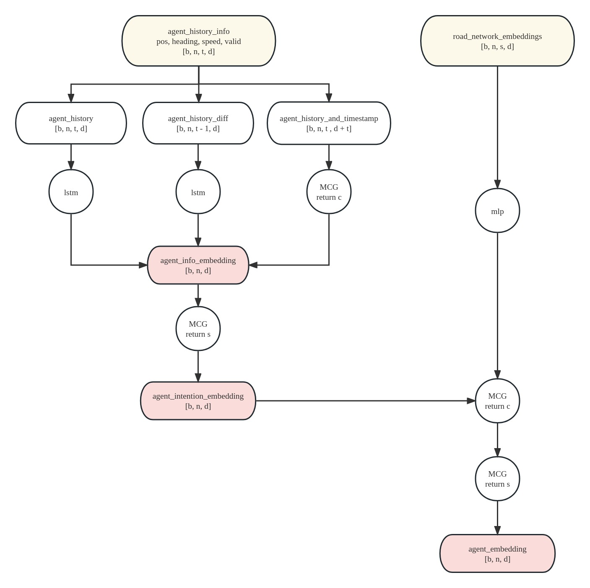

# Joint Multipath++ for Sim Agent
Joint Multipath++(2nd) for Sim Agent in waymo competition 2023 of CVPR workshop

Paper: https://storage.googleapis.com/waymo-uploads/files/research/2023%20Technical%20Reports/SA_hm_jointMP.pdf

## Prerender
First we need to prepare data for training. The prerender script will convert the original data format into set of .npz files each containing the data for one scene. From code folder run
```
python3 prerender/prerender.py \
    --data_path /path/to/original/data \
    --output_path /output/path/to/prerendered/data \
    --config NCloseSegAndValidAgentRenderer
```
The prerender module is completely self-contained.

## Model
### Encoder


## Train
```
python3 train.py \
    --train_data_path /path/to/train/data \
    --val_data_path /path/to/validation/data \
    --config configs/Multipathpp32.yaml
    --save_folder /save/path
```

## Rollout
```
python3 rollout.py \
    --test_data_path /path/to/test/data \
    --model_path /path/to/model \
    --config configs/Multipathpp32.yaml \
    --save_path /path/to/save/output
```

## Citation
The [previous work](https://github.com/stepankonev/waymo-motion-prediction-challenge-2022-multipath-plus-plus) of Stepan Konev who won the 3rd place in Waymo motion prediction challenge 2022 helps us a lot.
```
@misc{https://doi.org/10.48550/arxiv.2206.10041,
  doi = {10.48550/ARXIV.2206.10041},
  url = {https://arxiv.org/abs/2206.10041},
  author = {Konev, Stepan},
  keywords = {Computer Vision and Pattern Recognition (cs.CV), FOS: Computer and information sciences, FOS: Computer and information sciences},
  title = {MPA: MultiPath++ Based Architecture for Motion Prediction},
  publisher = {arXiv},
  year = {2022},
  copyright = {arXiv.org perpetual, non-exclusive license}
}
```
